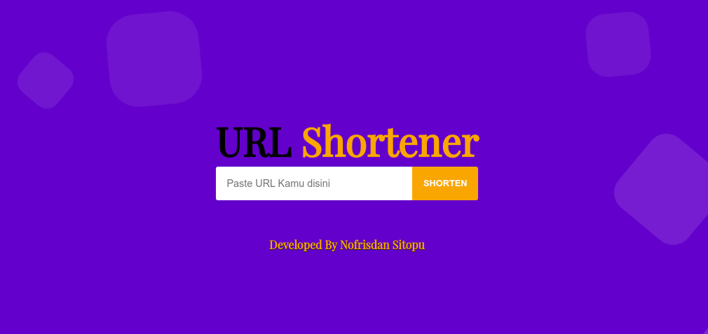

# Tentang ShortLinkApp

ShortLinkApp merupakan sebuah aplikasi yang berfungsi untuk menyingkat sebuah link yang panjang menjadi link yang sangat singkat

## Teknologi Yang Digunakan

### Frontend

<h5>React JS</h5>

### Backend

<h5>Codeigniter4</h5>

## Cara Instalasi

### Clone GIthub

```
 git clone https://github.com/Nofrisdan/short-link-app.git

```

## Gambar Aplikasi


